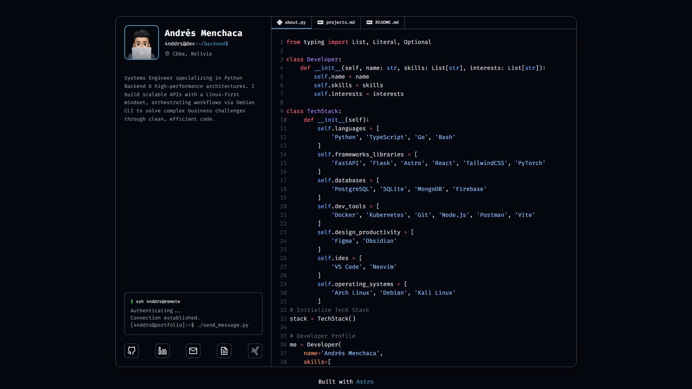
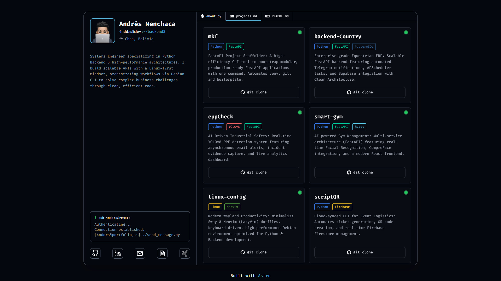
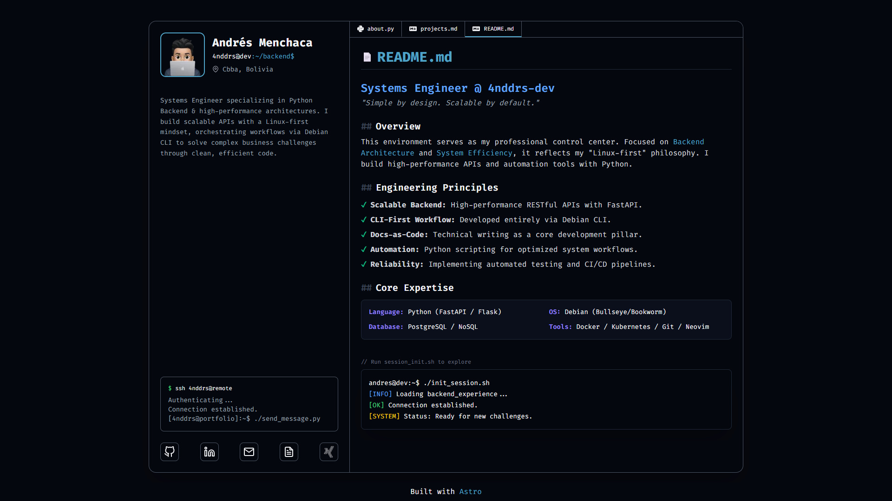

# Portfolio

Developer portfolio built with Astro, showcasing projects and technical skills through an interactive terminal-inspired interface.

## Preview

<p align="center">
  
</p>

<p align="center">
  
</p>

<p align="center">
  
</p>

## Tech Stack

**Languages:** Python · TypeScript · Go · Bash

**Frontend:** Astro · React · TailwindCSS

**Backend:** FastAPI · Flask · Node.js

**Databases:** PostgreSQL · SQLite · MongoDB · Firebase

**DevOps:** Docker · Kubernetes · Git · Vite · Postman

**AI/ML:** PyTorch · YOLOv8

**Design:** Figma · Obsidian

**Environment:** VS Code · Neovim · Arch Linux · Debian · Kali Linux

## Features

- Tab-based navigation with smooth transitions
- Syntax-highlighted code display
- Responsive design for mobile and desktop
- Dark theme with modern UI

## Getting Started

```bash
# Install dependencies
npm install

# Run development server
npm run dev

# Build for production
npm run build
```

## License

MIT
